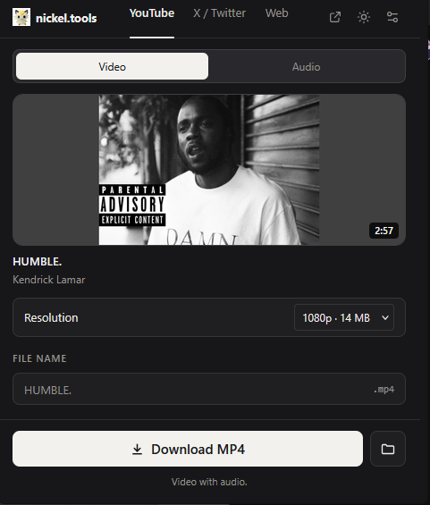
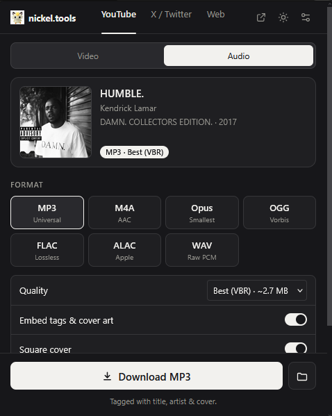
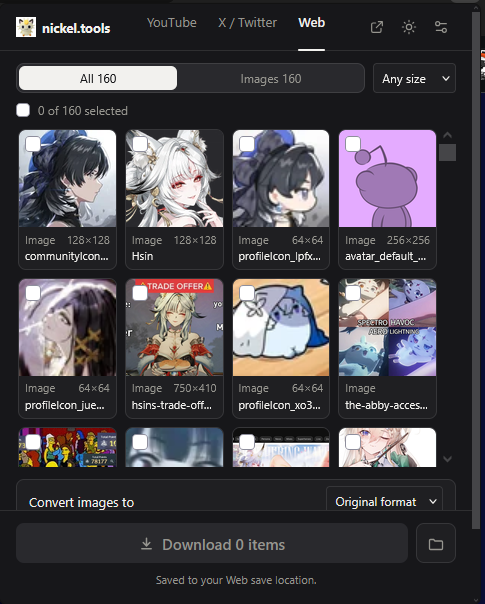
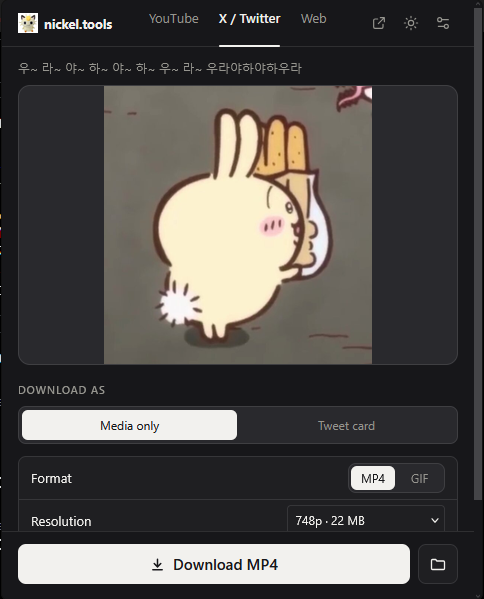
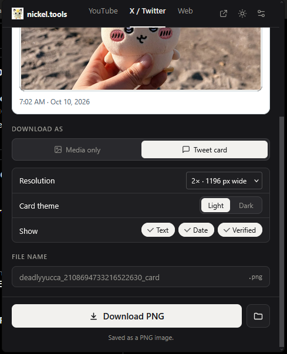
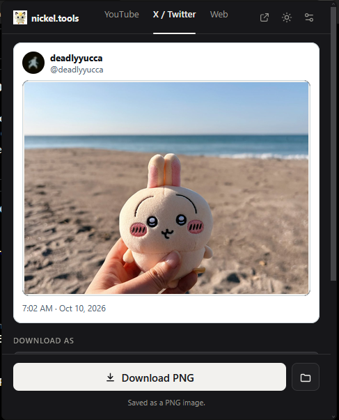

# nickel.tools []
Based on the fork by [leoconnn](https://github.com/leconnn/youtube-dl-extension) which is forked from [youtube-dl](https://github.com/ytdl-org/youtube-dl), heavy references to the web tool [cobalt.tools](https://cobalt.meowing.de/). This fork is for my personal use only, I do not claim anything in these repositories.

## Image previews

<table>
<tr>
<td align="center" valign="top"> <b>YouTube · Video</b></td>
<td align="center" valign="top"> <b>YouTube · Audio</b></td>
<td align="center" valign="top"> <b>Web · Media</b></td>
</tr>
<tr>
<td align="center" valign="top"> <b>X / Twitter · Media only</b></td>
<td align="center" valign="top"> <b>X / Twitter · Tweet card</b></td>
<td align="center" valign="top"> <b>X / Twitter · Card preview</b></td>
</tr>
</table>

## Key features 

- **YouTube video download**: pick the resolution (with the estimated file
  size shown before you download), the video codec (H.264, VP9 or AV1), and
  the container (MP4, MKV or WebM).

- **YouTube audio download**: extract audio as MP3, M4A, Opus, OGG, FLAC,
  ALAC or WAV at your chosen quality. Title, artist and cover art can be
  edited in the popup and are embedded in the file as tags.

- **Twitter/X media download**: save a tweet's photos, videos and GIFs as-is.
  Photos can be saved at Original, Large, Medium or Small size as PNG, JPG,
  WebP or GIF; videos can be saved at your chosen resolution or converted to
  a GIF (with adjustable frame rate, speed and width).

- **Twitter/X tweet card**: render a tweet as an image (or an MP4, for video
  and GIF tweets) in a light or dark card theme. You can toggle the profile
  name, @handle, date and verified badge, and choose the card's resolution.

- **Web media download**: grab the video or audio from other web pages, in
  the same formats as above, plus the images embedded in HTML pages.

  > **Disclaimer:** Web media download relies on [yt-dlp](https://github.com/yt-dlp/yt-dlp)
  > and on how each site serves its media, so it is only guaranteed to be
  > tested on YouTube. Other sites are "should work" rather than verified, and
  > some will fail, especially those that use DRM-protected or login-gated
  > streams, which are not supported. Only download content you own or have
  > permission to save, and respect copyright and each site's Terms of
  > Service. You are responsible for how you use this tool.

## How to Install

Windows only. One installer covers every supported browser you have: it
detects Firefox, Chrome, Edge and Brave and only sets up the ones it finds.

1. Close your browsers, then download `nickel-tools-setup.exe` from the
   [latest release](https://github.com/teamuhi/nickel-tools/releases/latest).
2. Run it. If Windows SmartScreen warns about an unknown publisher (the
   installer isn't code-signed), click **More info** > **Run anyway**, then
   approve the admin prompt.
3. Finish setup, then follow the step for your browser:

| Browser | After installing |
| --- | --- |
| **Firefox** | Open Firefox. If the extension doesn't appear, drag `nickel-tools.xpi` (in `C:\Program Files\nickel-tools`) onto the Firefox window and click **Add**. |
| **Chrome** | Open (or restart) Chrome. The extension installs itself, no manual steps. |
| **Edge** | Open (or restart) Edge. The extension installs itself, no manual steps. |
| **Brave** | Open (or restart) Brave. The extension installs itself, no manual steps. |

Then open a page with media and click the toolbar icon (it may be under the
puzzle-piece menu; pin it to keep it visible).

To remove everything, uninstall **nickel.tools** from Windows Settings.

## How to Update

Updating is the same as installing: you run the newer installer over the old
one. Your settings and download history are kept, and there's no need to
uninstall first.

1. Check your current version at the bottom of the extension's **Settings**
   (it reads `nickel.tools <version> · host <version>`, or says the host is
   outdated), and compare it with the
   [latest release](https://github.com/teamuhi/nickel-tools/releases/latest).
2. Close all your browsers (Firefox in particular only picks up the new
   extension when it starts).
3. Download the new `nickel-tools-setup.exe` from the latest release and run
   it. The installer replaces the old files in place, so approve the admin
   prompt as before.
4. Open your browser again. In Firefox, the new version is picked up on
   launch; if the old one is still showing, check `about:addons`, or drag the
   updated `nickel-tools.xpi` (in `C:\Program Files\nickel-tools`) onto the
   Firefox window, as in the install steps.

Why use the installer rather than just waiting for the browser to update it:
Chrome, Edge and Brave may fetch a newer extension on their own from the
release's `update.xml`, but that only updates the extension. The bundled
program that does the actual downloading (yt-dlp, ffmpeg) only updates
through the installer, and some releases need both to match. Firefox never
updates the extension on its own, since it isn't on the Add-ons store.

**[See `browser-extension/README.md` for the actual project](browser-extension/README.md):**
what it does, how to install it, and how it works.

## Recent changes

- Export state outside the popup: while a download runs, the toolbar icon
  shows a progress badge (`42%`, the count when several run, then a check or
  `!`) with the title in its tooltip, and a "started" notification is
  replaced by the finished/failed one. All of it can be turned off in
  Settings.
- "Download to a specific folder" and the Settings **Browse...** buttons open
  the normal Windows folder dialog (with its own "Make New Folder" button).
  The extension's background script runs the dialog and starts the download
  or saves the setting afterwards, so it works even though the popup closes
  while the dialog has focus.
- Many more settings: notifications and badge, theme (System/Light/Dark),
  startup tab, remember last-used options, download history, host/yt-dlp versions and a reset button.
- YouTube tab: pick the video container (MP4, MKV or WebM), with a default in
  Settings. WebM is limited to VP9/AV1 and falls back to MP4 if the video
  doesn't offer them.

- YouTube tab: new "Preferred codec" picker under Resolution (H.264 + AAC as
  MP4, VP9 + Opus or AV1 + Opus as WebM). Only codecs the video offers are
  listed; if one isn't available at the chosen resolution it falls back to
  H.264 and says so. Needs the rebuilt native host.
- Better page detection on the Web tab: the page scan now also picks up
  lazy-loaded images (`data-src` etc.), CSS background images, media inside
  iframes and shadow DOM, and HLS/DASH streams. If yt-dlp can't handle a
  page (not only "unsupported URL"), the popup falls back to the Web tab.

## Layout

- `browser-extension/`: the actual project. Start with its README.
  - `backend/core.py`: the shared extraction/download logic, a thin layer
    over yt-dlp (installed as a normal pip dependency, not vendored here).
  - `native-host/`: the native messaging host every browser's extension
    talks to (same program for all of them), and the PyInstaller build that
    bundles it with yt-dlp and ffmpeg into a standalone Windows program.
  - `extension/`: the Firefox WebExtension (Manifest V2).
  - `extension-chromium/`: the Chrome/Edge/Brave-specific parts of the
    extension (Manifest V3); shares most of its UI code with `extension/`
    at build time rather than duplicating it.
  - `installer/`: the Windows installer (Inno Setup) that ties all of the
    above together into one `.exe`, for every browser it finds installed.

This repo used to be a full fork of the original youtube-dl CLI project;
that history (its own CLI, docs, packaging, and test suite) has been
removed since none of it applies here, this is a browser extension project
that depends on yt-dlp as a library, not a fork of a CLI tool.

## License

Unlicense (public domain), see `LICENSE`. This covers this repository's own
code; yt-dlp is a separate dependency (also Unlicense) installed via pip,
not vendored here.
